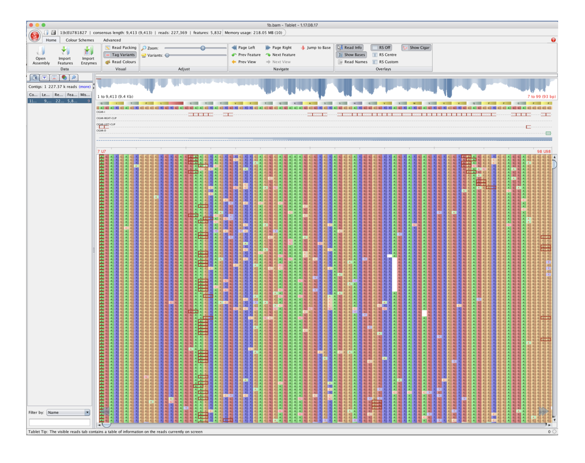
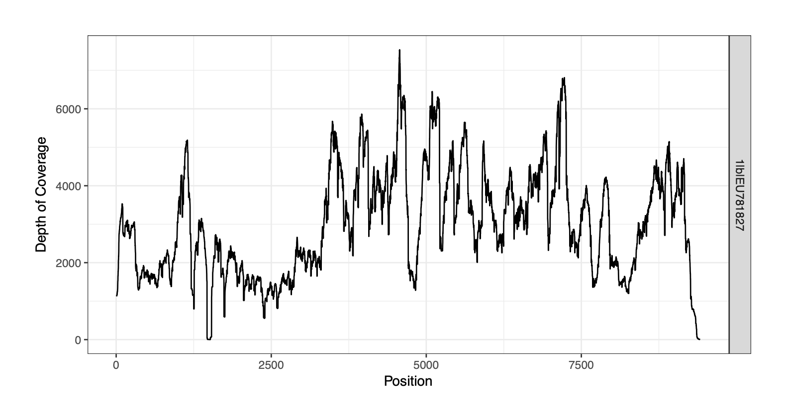
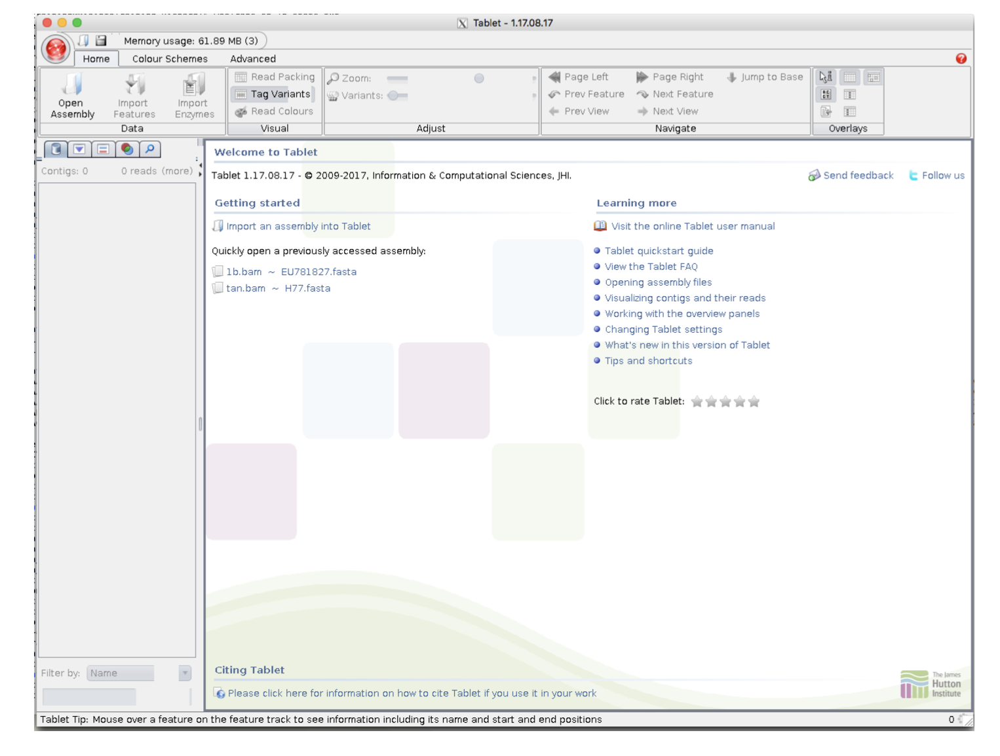
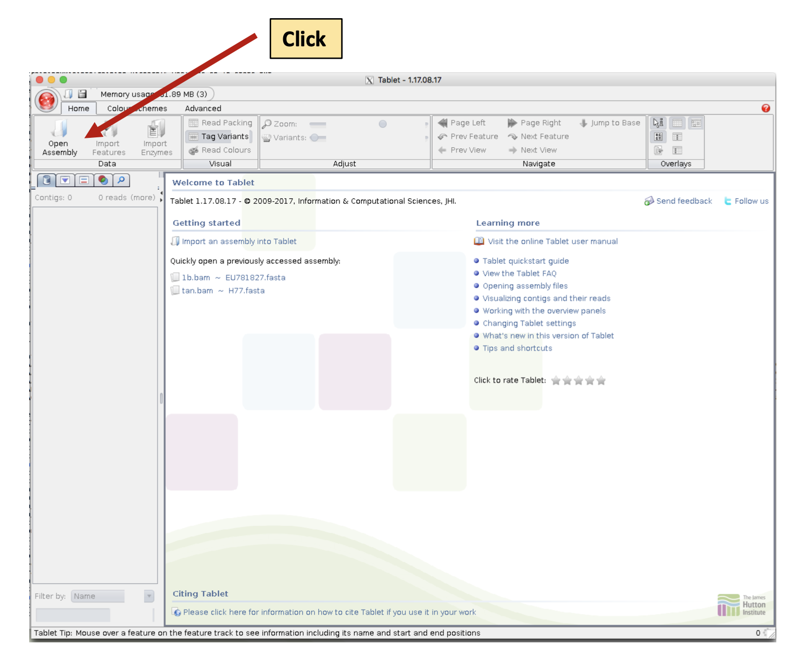
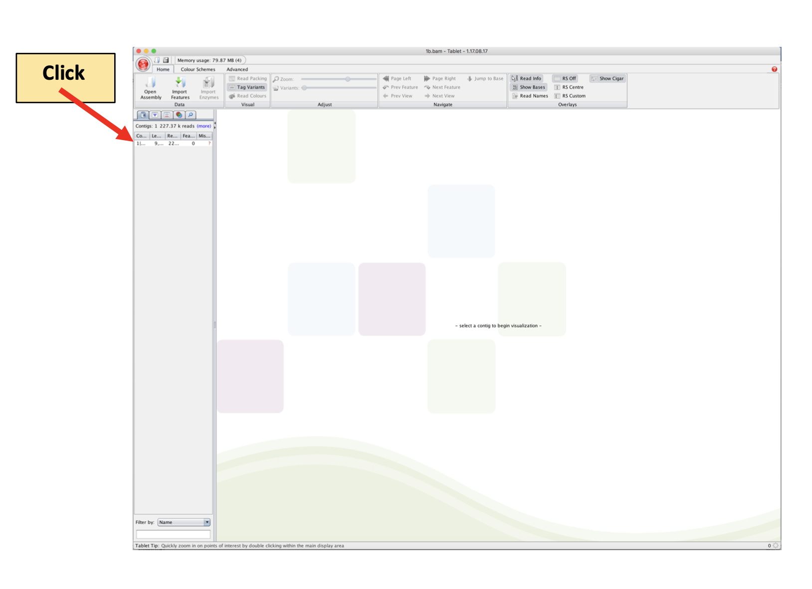
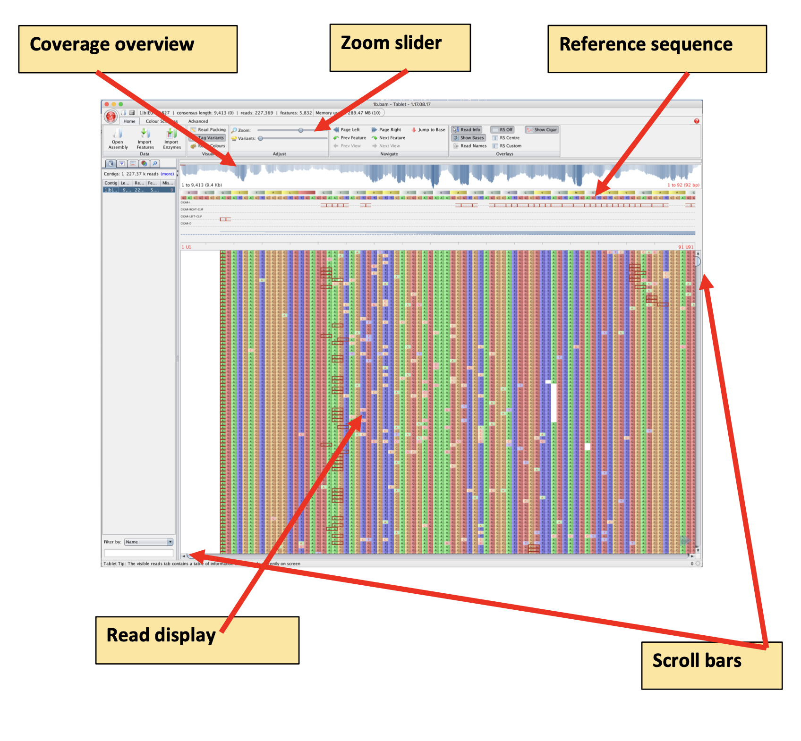
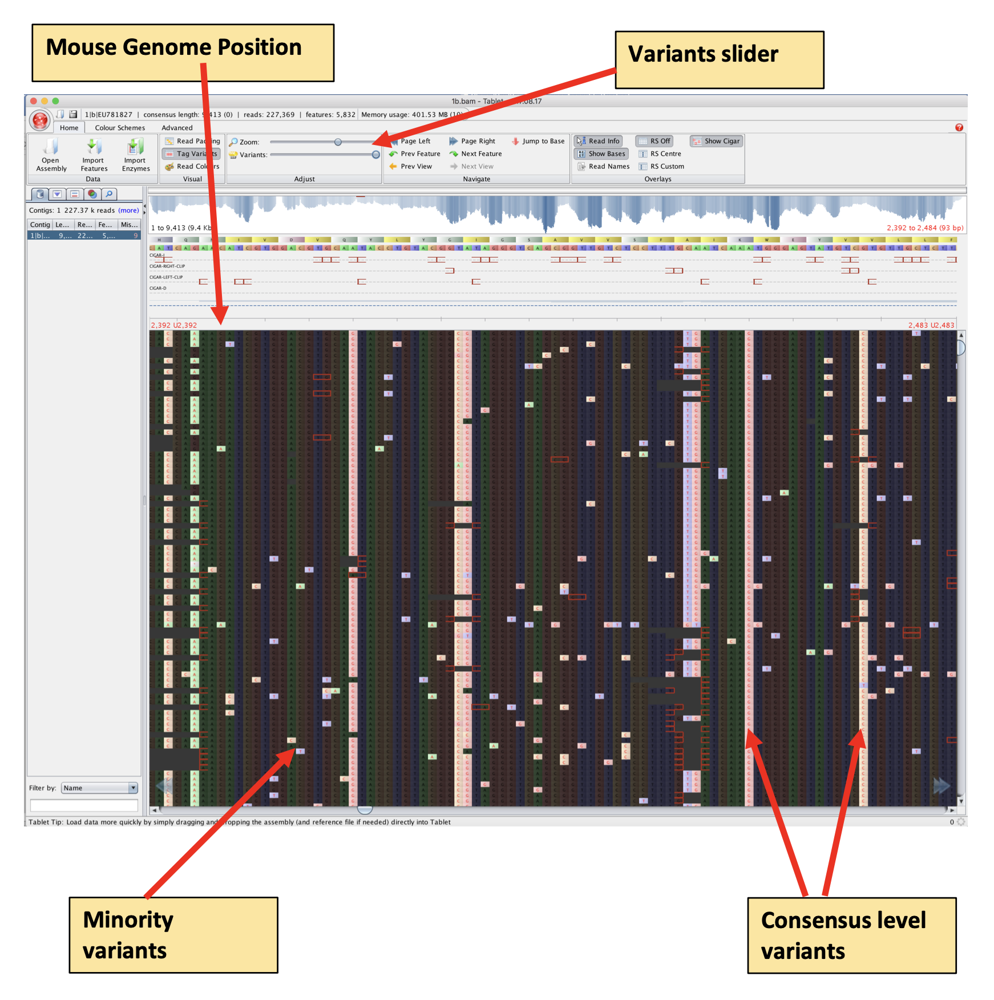

# [GECO Viral Bioinformatics training](https://github.com/josephhughes/viral-bioinformatics-training)
* Monday 21st - Friday 25th November 2022 - Manila, Philippines
* Practical adapted from [Richard Orton's tutorial](https://github.com/WCSCourses/ViralBioinfAsia2022/blob/main/Modules/SARS-CoV-2.md) 

## Contents

* [2: Alignment visualization and statistics](#2-alignment-visualization-and-statistics)
	+ [2.1: Extracting statistics with weeSAM](#21-extracting-statistics-with-weesam)
	+ [2.2: Visualizing the alignment with Tablet](#2.2-visualizing-alignment-with-tablet)

## 2: Alignment visualization and statistics

In this practical, we will be checking our reference assembly from the previous session. We will use tools to generate summary statistics of the depth and breadth of the coverage across the genome, coverage plots, and visualisation of our assembly using tools such as Tablet and weeSAM. Later sessions of the course will cover how to call the consensus sequence and variants.





### 2.1: Extracting statistics with weeSAM

We previously used samtools to count the number of mapped and unmapped reads (using the command samtools view -c -F4 ebola.bam), but let’s explore this is more detail using a tool called weeSAM: https://github.com/centre-for-virus-research/weeSAM
weeSAM analyses a SAM or BAM file, generates a graphical coverage plot, and reports a range of summary statistics such as:

* Ref_Name = The identifier of the reference
* Ref_Len = The length in bases of each reference
* Mapped_Reads = Number of reads mapped to each reference
* Breadth = The number of sites in the genome covered by reads
* %_Covered = The percent of sites in the genome which have coverage
* Min_Depth = Minimum read depth observed
* Max_Depth = Maximum read depth observed 
* Avg_Depth = Mean read depth observed
* Std\_Dev = Standard deviation of the mean (Avg_Depth)
* Above\_0.2\_Depth = Percentage of sites which have greater than 0.2 * Avg_Depth
* Above\_1\_Depth = Percentage of sites which are above Avg_Depth
* Above\_1.8\_Depth = Percentage of sites which have greater than 1.8 * Avg_Depth
* Variation\_Coefficient = The mean divided by the Std_Dev of the mean

The Average Depth (Avg\_Depth) is perhaps the most important field, along with Breadth which will tell you how much of the genome is covered by aligned reads. But the fields such as Std\_Dev and Above\_0.2\_Depth can give an indication of the variability in the coverage across the genome.

Let’s run weeSAM on our samples:

```
cd ~/GECO_course_data/Reference_alignment/

weeSAM --bam Vero_SARS2.bam --html Vero_SARS2
```

An explanation of this command is:

* **weeSAM**: the name of the program we are using 
* **–-bam**: flag to signify input bam file
* **Vero_SARS2.bam**: the name of our bam file to analyse 
* **–-html**: flag to signify output html file
* **Vero_SARS2**: the name to label the output html file


If you list ```ls``` the contents of the directory you should see that the folder ```Vero_SARS2_html_results``` has been created.

Inside this folder is a HTML file that we can view in a web browser (like Firefox or Chrome), the HTML file has the summary statistics and coverage plot so lets take a look and open the html file:

```
firefox Vero_SARS2_html_results/Vero_SARS2.html
```

**Question – what is the average depth of coverage across the ebola reference genome?**

Now let’s view the coverage plot by clicking on the hyperlink (blue and underlined) in the Ref_Name column, you should see a coverage plot.
The x-axis represents the genome position, whilst the y-axis represents the Depth of Coverage at each genome position.

**Close the weeSAM display before proceeding!**

Your task now is to run weeSAM on the bam file that was produced using Illumina amplicon data, the file was called ```CVR2058_trim.bam```. So you will need to move into the respective directory and adapt the previous weeSAM command.

**Question – what is the average depth of coverage across the CVR2058 reference genome?**

**Question – why does the coverage pattern look so different?**


### 2.2 Visualisation with Tablet

Tablet is a tool for the visualisation of next generation sequence assemblies and alignments. It goes beyond simple coverage plots, and allows you to scroll across the genome, zoom into errors of interests, highlight mutations to the reference, and investigate the assembly.
Tablet requires three files:

1. A bam file, e.g. Vero_SARS2.bam
2. A bam index file, e.g. Vero_SARS2.bam.bai
3. A reference sequence file: e.g. MN908947.fasta

To launch Tablet, type:
```
tablet
```

NB: You will not be able to use this command line for other things until you have closed down tablet – but you can open another command line window if you want to leave tablet open and do other things.
You should see the Tablet graphical user interface:



NB: Sometimes a small popup window also appears, giving information on how to correctly cite Tablet, with a brief countdown timer.
    
We want to load in our read alignment from the ebola genome. So Click on the Open Assembly button on the top menu bar.



This will launch the Open Assembly window, click Browse and then navigate to your ```~/GECO_course_data/Reference_alignment/``` folder and select the ```Vero_SARS2.bam``` file for Primary Assembly. Afterward, click Browse and select ```MN908947.fasta``` file from ```~/GECO_course_data/Reference_alignment/``` folder for Reference/Consensus File, before clicking Open.


After loading you should see the message **-select a contig to begin visualisation-** along with a list of contigs in the left hand panel. In our analysis, we have used a single sequence (the SARS2 Wuhan reference sequence), so our contig list only has one entry, click on this entry.



**NB:** We only have one contig as our reference sequence only consisted of one sequence (the Wuhan genome). However, you can align reads to a reference containing multiple sequences, such as the human genome consisting of multiple separate chromosome sequences, or a segmented virus such as influenza consisting of multiple separate segment sequences, or all of the contigs generated from a metagenomics data set.

Tablet should now load the entire BAM file for visualisation. You can use the scrollbars to move across the genome and view all the reads aligned against the reference.


#### 2.2.1 Read Display

In the read display, As, Cs, GS and Ts are represented with different colour blocks, Variants are highlighted with Red Text and a different shading, Deletions are represented with Red Asterisks, whilst the location of Insertions is highlighted with red boxes.
NB: Like insertions, soft clipping at the end of the reads are also highlighted with red boxes. Soft clipping is where the aligner has decided to discount a portion of the read (at the read’s beginning or end) to improve the alignment.
You can easily jump about the BAM alignment by clicking within the Coverage Overview window, and the read display will be updated to show this region.




#### 2.2.2 Variants

One of the useful features of Tablet is the ability to highlight variants. Slide the Variants Slider all the way to the right hand side to highlight variants. If you now scroll along the genome, you should be able to easily spot consensus level mutations (as virtually every read at a position will have a mutation) and also spot minority variants.
NB: Minority variants could be real viral mutations from the viral population or be errors introduced by RT-PCR or the sequencer itself.



**Question: Can you find a genome position that has a consensus level mutation?**
Hint: hold the mouse over a mutation and the genome location will be reported above the read display in red text

#### 2.2.3 Colours Schemes

Tablet also has a few other colour schemes for visualisation, accessed through the “Colour
Schemes” tab at the top. Try a few out, perhaps the most commonly used schemes are:

1. Nucleotide: this is the default one: As, Cs, Gs, and Ts represented with different colours
2. Direction: reads aligned in the forward direction are highlighted in light blue, whilst those in the reverse direction are highlighted in dark blue
3. Variants: represents As, Cs, Gs, and Ts with grey, and highlights any mutations with red.

#### 2.2.4 Exit

Remember that you need to close Tablet down in order to get your command line back.
Either click on the red cross in the top left hand corner, or click the Tablet icon (red circle) (located above Open Assembly) and select **Exit Tablet**.