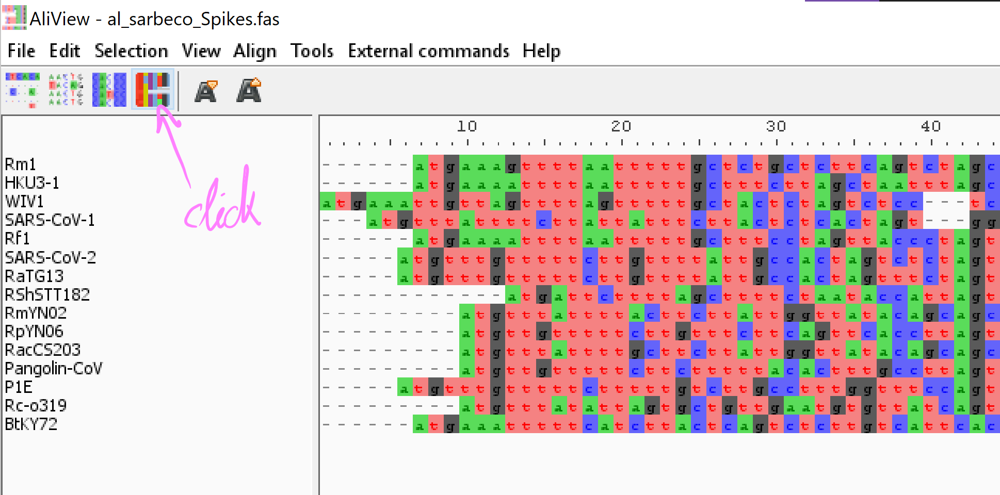
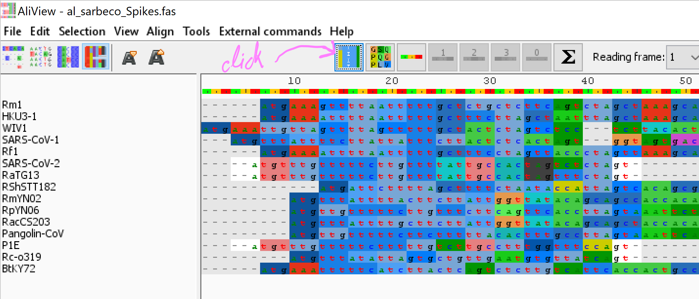
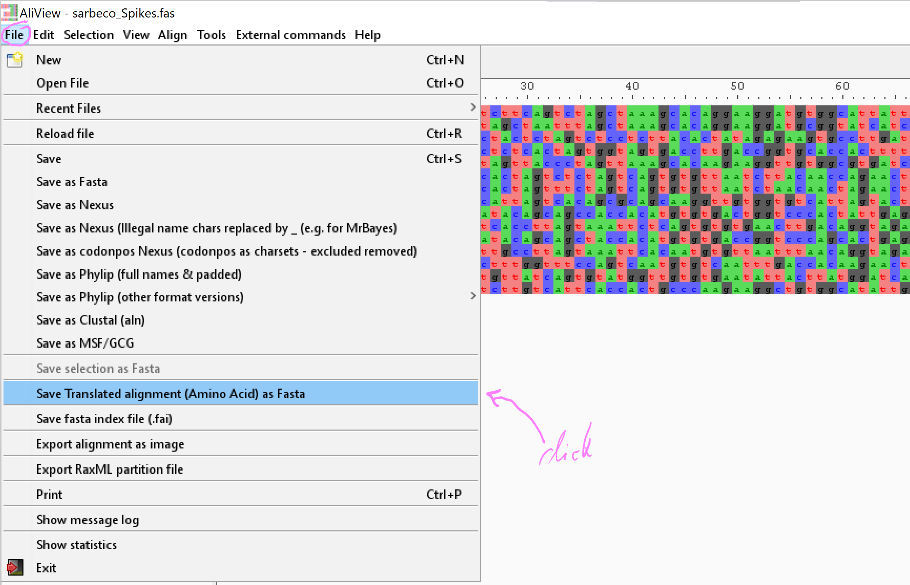

# [GECO Viral Bioinformatics training](https://github.com/josephhughes/viral-bioinformatics-training)
* Monday 21st - Friday 25th November 2022 - Manila, Philippines

## Contents

* [4.1: Alignments Tutorial](#41-alignments-tutorial)
	+ [4.1.1: Introduction](#411-introduction)
	+ [4.1.2: Nucleotide alignments](#412-nucleotide-alignments)
	+ [4.1.3: Protein alignments](#413-protein-alignments)
	+ [4.1.4: Codon alignments](#414-codon-alignments)
	+ [4.1.5: Reference constrained alignments](#415-reference-constrained-alignments)
	+ [4.1.6: Different alignment software](#416-different-alignment-software)
		+ [Final task](#final-task)


# 4.1: Alignments Tutorial

In this practical we will explore the importance of sequence alignments, how different
alignment algorithms and options (even on the same alignment software) can change the 
output, and why an alignment matters so much when doing phylogenetics.

## 4.1.1: Introduction

As explained in the lecture, an alignment is a hypothesis for how genetic code sequences 
are evolutionarily related to one another. This way we can determine **homology** between 
sequences, i.e. the nucleotides or peptide residues that match between the sequences.

Sequence alignments can either be pairwise, i.e. only between two sequences (for example this
is what algorithms like BLAST and DIAMOND do), or multiple sequence alignments (MSA), i.e. between 
more than one homologous sequences (this is what we're going to focus on here). 

Unlike pairwise alignments, MSA algorithms consider homology between all the sequences in the
dataset at the same time, hence a pairwise alignment between two sequences might differ from the 
alignment of the same two sequences when aligned together with other ones.

For the first part of this tutorial we have prepared a set of 15 SARS-related Spike gene sequences,
including SARS-CoV-1, SARS-CoV-2 and the pangolin coronaviruses we assembled yesterday.
The alignment tool we will primarily be using is called [mafft](https://mafft.cbrc.jp/alignment/software/)
and it's an easy-to-use, popular command-line tool with many algorithm options.

Create a new directory for this tutorial and copy the `sarbeco_Spikes.fas` file into it that
you can find in the `/home/manager/GECO_course_data/Alignments` directory.


## 4.1.2: Nucleotide alignments

We will start by simply aligning the nucleotide sequences of the Spike genes in the fasta file
provided, but we will try all the main options of mafft.

First, the quickest (and least accurate) command, simply providing the sequence file name and 
the output file name:

```

mafft sarbeco_Spikes.fas > al_sarbeco_Spikes.fas

```

	📝 Can you try using the `time` command at the start of each mafft operation to compare
	how long it takes to run each option?
	
Second, the `--localpair` option:

(probably most accurate; recommended for <200 sequences; iterative refinement method incorporating local pairwise alignment information)

```

mafft --maxiterate 1000 --localpair sarbeco_Spikes.fas > al_sarbeco_Spikes_linsi.fas

```

Third, the `--genafpair` option:

(suitable for sequences containing large unalignable regions; recommended for <200 sequences)

```

mafft --maxiterate 1000 --genafpair sarbeco_Spikes.fas > al_sarbeco_Spikes_einsi.fas

```

Finally, the `--globalpair` option:

(suitable for sequences of similar lengths; recommended for <200 sequences; iterative refinement method incorporating global pairwise alignment information)

```

mafft --maxiterate 1000 --globalpair sarbeco_Spikes.fas > al_sarbeco_Spikes_ginsi.fas

```

- See the descriptions of all options in the [mafft manual page](https://mafft.cbrc.jp/alignment/software/manual/manual.html)


A crucial step in aligning sequences is visually inspecting the resulting alignment.

As we already saw here there are many different algorithms and options to align sequences
and the human eye is one of the best judges to determine which algorithm best suits each sequence
dataset. 

Now that you have made your nucleotide alignments it's time to check them by eye! For that we will
use the alignment viewer program called [AliView](https://ormbunkar.se/aliview/).

Open any alignment from the command line with `aliview al_sarbeco_Spikes.fas`


Make sure you spend some time scrolling through the alignments:

- Can you see any differences between alignments made by different methods?

- Are there specific areas in the Spike genes that have been aligned differently? 


## 4.1.3: Protein alignments

Remember that we are aligning gene coding sequences. This means that you could
theoretically translate your nucleotide alignments into protein alignments.

Open one of the nucleotide alignments you made with AliView and see if you can translate the 
alignment as follows:

1. Click on the 'translate nucleotide sequence to Amino Acids' button:



2. Click on the 'show Amino Acid code' button:



- Does the translated alignment look correct?

- Are all coding sequences in frame?

- What could be the problem?

To make sure you have a proper amino acid alignment of the peptides
encoded by these coding sequences you can translate them before aligning and 
then align the peptide sequences themselves.

Open the unaligned fasta file with AliView, go to File and 'Save Translated alignment as Fasta':




After you have saved the protein sequence fasta file, try aligning it with mafft.

- Which alignment algorithm would you use?

Open the resulting alignments with AliView. How does it compare to just translating
the nucleotide alignment?


## 4.1.4: Codon alignments

A nucleotide alignment is useful for determining relatedness between both coding and noncoding sequences,
identifying changes on the nucleotide level.

A protein alignment is useful for determining similarities and differences between proteins, 
essential for identifying potentially functional changes between proteins.

Another type of alignment - a combination or subcategory of the above - can be a very useful tool
for evolutionary analysis, that is the codon alignment. As you saw however, if you simply align
nucleotide coding sequences the algorithm does not preserve the coding frames in the alignment. 

The best way to make a codon alignment is to make a protein alignment - i.e. determine how amino acids
are related - and then 'reverse-translate' the peptide alignment back to nucleotide (codon), by
replacing each amino acid - in place - with its respecrive codon. The most convenient 
program for doing this is called [pal2nal](http://www.bork.embl.de/pal2nal/) (and intuitively enough
stands for 'protein alignment to nucleotide alignment'). 

Try the following command:

```

pal2nal.pl al_sarbeco_Spikes.translated.fas sarbeco_Spikes.fas -output fasta > al_sarbeco_Spikes_cod.fas

```

The order of options for the pal2nal command should be:

1. the amino acid alignment

2. the unaligned coding sequence fasta file

3. the `-output fasta` option should be included, otherwise the output
file will be in clustal format by default (instead of fasta)

The output of pal2nal is printed in standard output, so you need to direct it (`>`) in the file of choice.


	📝 It is essential that the unaligned nucleotide file provided to pal2nal matches the 
	amino acid alignment! (otherwise pal2nal will fail).

- How does this codon alignment compare to the nucleotide alignment you made at the start?

- Make sure you carefully compare the alignments visually in AliView.


## 4.1.5: Reference constrained alignments

This last exercise will explain a very special case of aligning sequences that is
particularly useful when you are trying to align very diverse sequences.

Imagine you want to reconstruct the phylogenetic relation between a diverse group of
viruses. If there's many mismatches and redundant information in the sequences, alignment
algorithms can be confused and produce a sub-optimal alignment that misrepresents the real
homology of the sequences.

In such cases you might want to inform the alignment algorithm by providing a simpler,
but well curated alignment of few representative sequences and then add the 
new sequences into the existing 'root' alignment.

To test this out, we have put together a set of human *Anelloviridae* viruses. These are
small (2-3kb long) circular single-stranded DNA viruses that are found almost ubiquitely in
all human individuals and have a very wide genetic diversity. There are 3 main clades of human 
anelloviruses that differ in their genome lengths. The representative viruses for each clade are:
Torque Teno Virus (TTV), Torque Teno Mini Virus (TTMV), and Torque Teno Midi Virus (TTMDV).

We have provided you with a well-curated root alignment of the 3 representative virus genomes,
as well as a set of unaligned, diverse anellovirus genomes.


Open the two `_anello.fas` fasta files with AliView. What do you think of the homology in the root
alignment file and the diversity between the unaligned sequences?


To add the unaligned sequences into the root alignment you will use the [mafft *--add* option](https://mafft.cbrc.jp/alignment/server/add.html):

```

mafft --add all_anello.fas --keeplength --reorder al_root_anello.fas > al_all_root_anello.fas

```

Let's break this down:

- the `--add` option should be followed by the fasta file with unaligned sequences to be added

- `keeplength` tells the program to maintain the same length of the original alignment, i.e. any insertions
that the new sequences have compared to the sequences in the root alignment will be removed. Once the alignment
is ready check that the length is the same.

- `--reorder` tells the program to change the order of the new alignment, so that more similar sequences are placed
closer together. Without making a phylogenetic tree, can you tell which sequences fall within which major *Anelloviridae*
clade> (TTV, TTMV, TTMDV).

- The last argument should be the root alignment that you're adding the sequences into.
`


After you have a look at this alignment try to align the same sequences without the `--keeplength`
option and without the `--add` option (simply make a nucleotide alignment).

	📝 You will need to put all sequences in a single file to make a simple nucleotide alignment
	of all sequences. Use what you learned in the bash scripting session to do this! 


- What's different between these alignments?

- How do you think the different methods would affect the phylogenetic reconstruction
based on each alignment?

<br>

## 4.1.6: Different alignment software

There's many other good software for making alignments, for example:

- [ClustalW](http://www.clustal.org/omega/)

and

- [Muscle](https://bmcbioinformatics.biomedcentral.com/articles/10.1186/1471-2105-5-113)


You can try remaking your mafft alignment with this software as follows:

```

clustalw -infile=sarbeco_Spikes.fas

```


```

muscle -in sarbeco_Spikes.fas -out al_sarbeco_Spikes_muscle.fas

```


- How does the performance compare between different software?

- Do the output alignments differ?

- Which softwares/options makes the most similar and most different alignments?