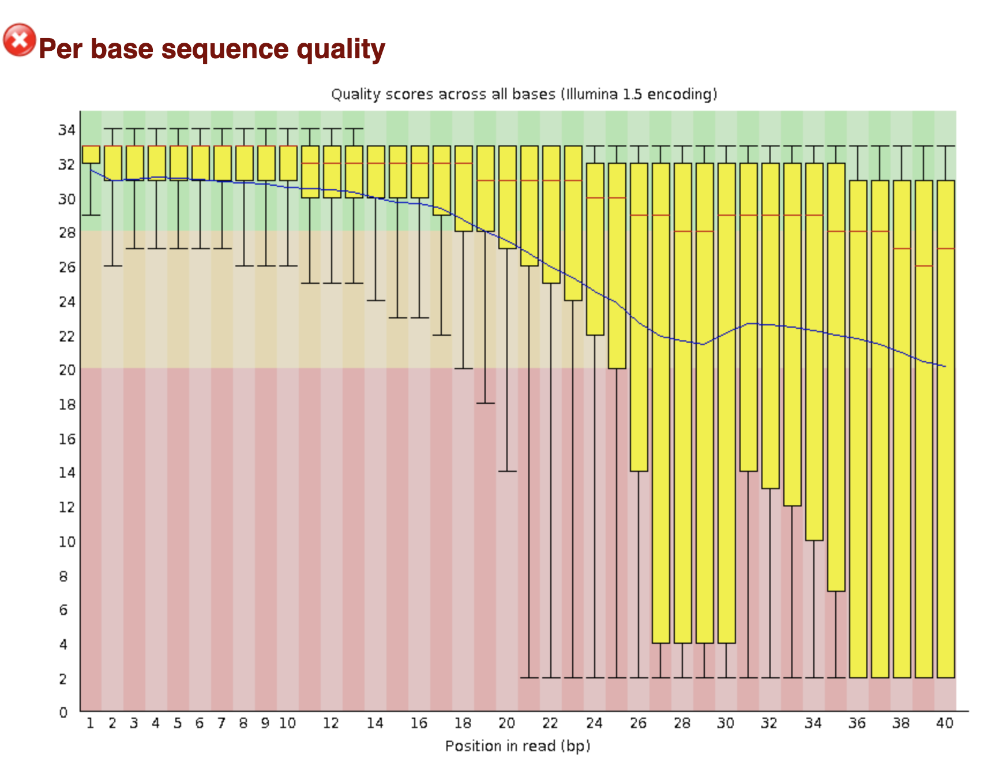
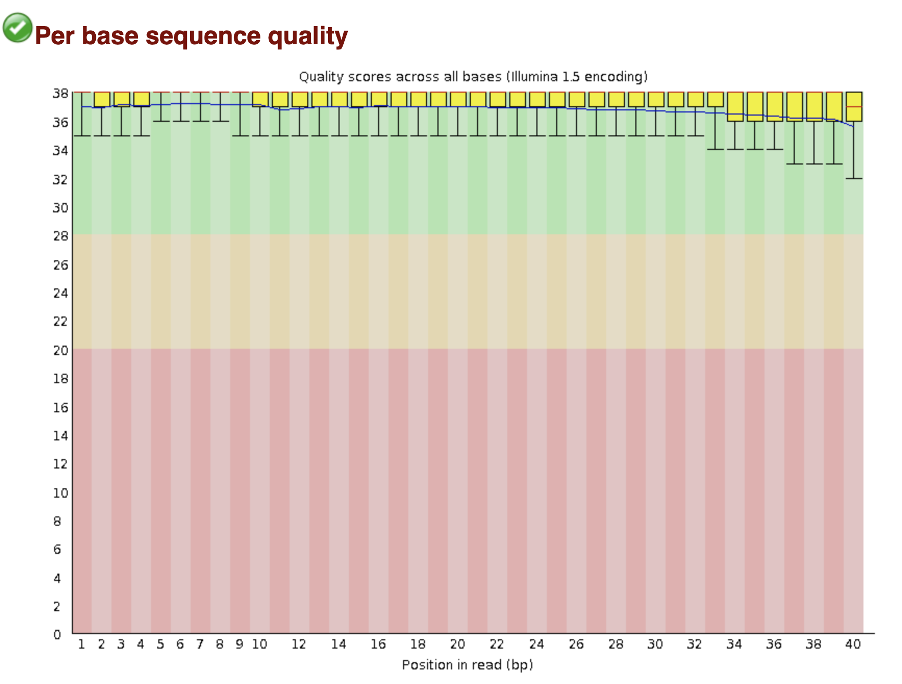
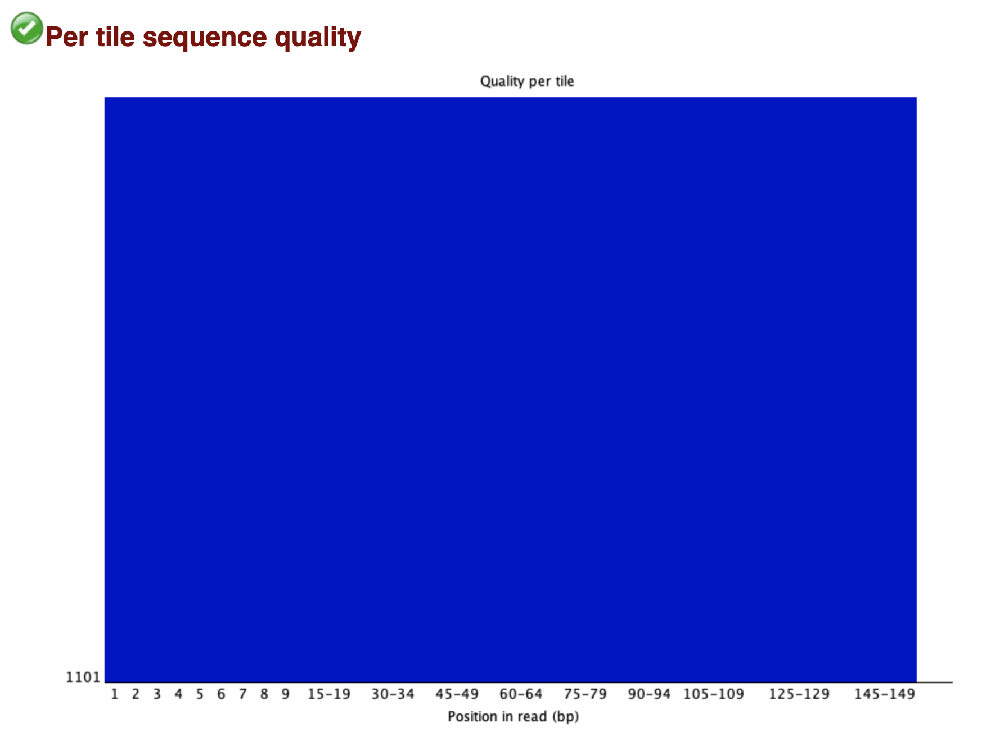
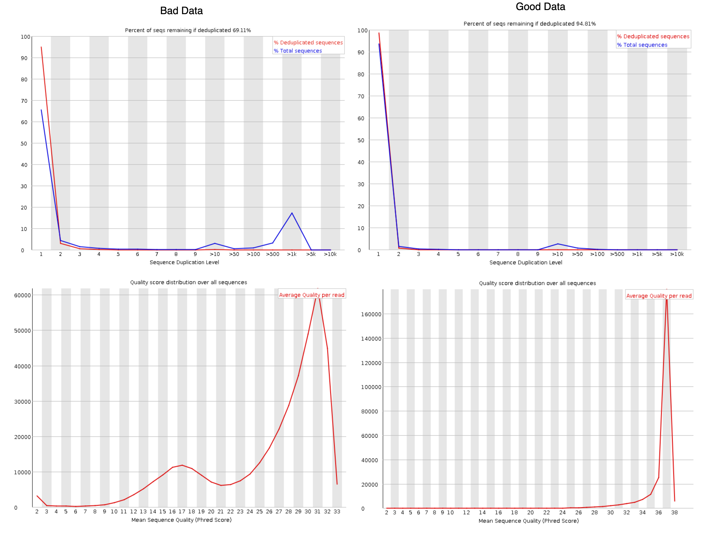

---
output:
  pdf_document: default
  html_document: default
---
# [GECO Viral Bioinformatics training](https://github.com/josephhughes/viral-bioinformatics-training)
* Monday 21st - Friday 25th November 2022 - Manila, Philippines

# Contents

- [GECO Viral Bioinformatics training](#geco-viral-bioinformatics-training)
- [Contents](#contents)
- [1: Quality Control (FastQC)](#1-quality-control-fastqc)
  - [1.1 Running FastQC](#11-running-fastqc)
    - [Task 1](#task-1)
- [2: Trimming Reads (cutadapt)](#2-trimming-reads-cutadapt)
- [3: Trimming Reads and Quality Control in one! (trim_galore)](#3-trimming-reads-and-quality-control-in-one-trim_galore)
    - [Task 2](#task-2)

# 1: Quality Control (FastQC)
When we obtain our sequencing reads from the NGS sequencers, we typically get them in the form of a fastq file. These files contain sometimes millions of reads, read ids, optional metadata fields and their quality scores. The initial set of sequence reads collected from the sequencer can have a number of defects that must be detected before any further processing of the reads can be completed. This can include contamination by adapter sequences (these are artificial DNA sequences that are necessary for the sequencing process) or the presence of low quality sequence reads (especially at the end of longer reads). As such we need a tool to detect the quality of or reads so that we know if any post-processing is required to "clean" them. FastQC does exactly this, producing a report that allows us to check various properties of the sequence reads to help us determine if they are of a suitable quality.

## 1.1 Running FastQC
FastQC can be run on the command line by using the `fastqc` command. The program takes a fastq file (or a wildcard such as *.fq to pass multiple fastq files) and generates a report html file which can be opened in the browser. 

```bash
kieran@linuxmachine:~$ fastqc Datasets/fastq_data/illumina_10K.fastq.gz
Started analysis of illumina_10K.fastq.gz
Approx 10% complete for illumina_10K.fastq.gz
Approx 20% complete for illumina_10K.fastq.gz
Approx 30% complete for illumina_10K.fastq.gz
Approx 40% complete for illumina_10K.fastq.gz
Approx 50% complete for illumina_10K.fastq.gz
Approx 60% complete for illumina_10K.fastq.gz
Approx 70% complete for illumina_10K.fastq.gz
Approx 80% complete for illumina_10K.fastq.gz
Approx 90% complete for illumina_10K.fastq.gz
Approx 100% complete for illumina_10K.fastq.gz
```
If we look at an example report showing a poor quality fastq file we might see something like this. While we get consistently good quality for bases at the begining of the sequence reads, the quality gets increasingly more variable as we progress and many of the positions past base 28 are medium to low quality. With a properly QC'd fastq file, we would hope to see something more like the image below on the right, where the base qualities remain withing the high quality zone.

| **Bad Data** | **Good Data** |
|:--------:|:---:|
|    |  |


A set of sequences with very poor quality might be due to flow cells being damaged or faulty. If enough of the flow cell is affected by these issues, the sequencing may have to be repeated. Ideally the image below should show an all blue square indicating the quality is high at all positions in the cell.

| **Bad Data** | **Good Data** |
|:--------:|:---:|
|    |  |


FastQC produces a number of outputs that let you assess the sequence reads (Adapter Content, N Content, Sequence Duplication levels etc). In general, a set of good quality sequences should be passing as many of these checks as possible, with some warnings okay depending on the dataset being used.



| **Bad Data** | **Good Data** |
|:--------:|:---:|
|    |   |


___

### Task 1
Run FastQC on the file Datasets/fastq_data/illumina_10K.fastq.gz and have a look at the html report. Did anything fail?
___
# 2: Trimming Reads (cutadapt)
As previously mentioned, sequence reads have synthetic adapter sequences attached to them during the sequencing process. These adaptor sequences are not required for downstream use, and may prove harmful during the assembly or alignment processes since the adaptors are synthetic sequences that are not part of the sequence being assembled or aligned. As such, the adaptors should be removed to make dowstream tasks easier and less error prone. `cutadapt` is a command line tool that can remove sequence adaptors, as well as low quality reads so that the sequence reads left are of a good enough quality to use and lack the synthetic adaptor sequences. The program can be used as follows:

```bash
kieran@linuxmachine:~$ cutadapt -a AACCGGTT -o output.fastq.gz input.fastq.gz
```
The `-a` flag lets the user define the adaptor sequence, with the `-o` is used to identify the output file of the trimmed sequences. The `-p` flag can be specified if the sequence reads are paired-end sequences.

# 3: Trimming Reads and Quality Control in one! (trim_galore)
While `cutadapt` can be used on its own, it is more often paired with `fastqc` since it is necessary to check how sucessful the trimming and quality control has worked. `trim_galore` is a `perl` program that joins together `fastqc` and `cutadapt` into one easy to use command line tool that simplifies the workflow. `trim_galore` can also autodetect adaptor types so that they do not need to be specified (although they can still be specified if required with the `--illumina`, `--nextera` or `--small_rna` flags). To trim the files and run `fastqc`, the `--fastqc` flag can be used. As such, it is often easier to use `trim_galore`  rather than running each sub-program on its own. It can be run as follows:

```bash
kieran@linuxmachine:~$ trim_galore [-flags] [-files]
```
___

### Task 2
Run `trim_galore` on the Datasets/fastq_data/illumina_10K.fastq.gz file that you just checked with `fastqc`. Have a look at the trimmed `fastqc` report, has it changed?
___
