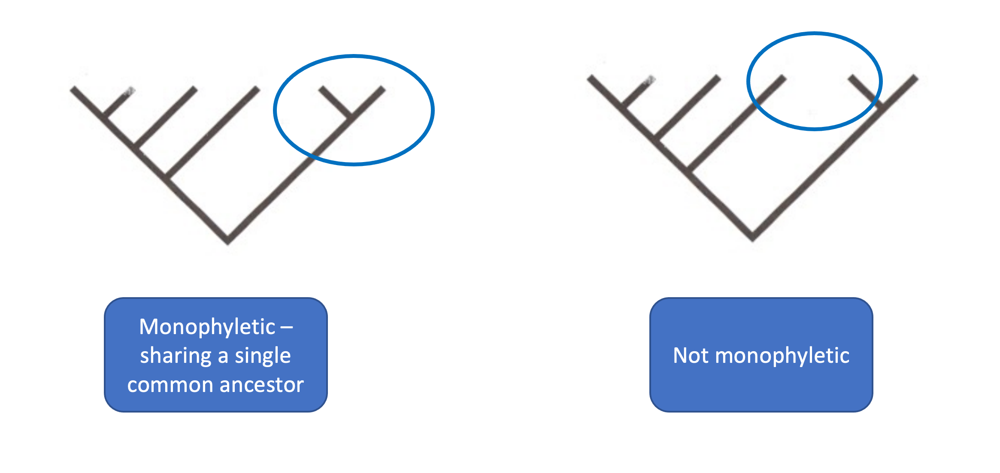
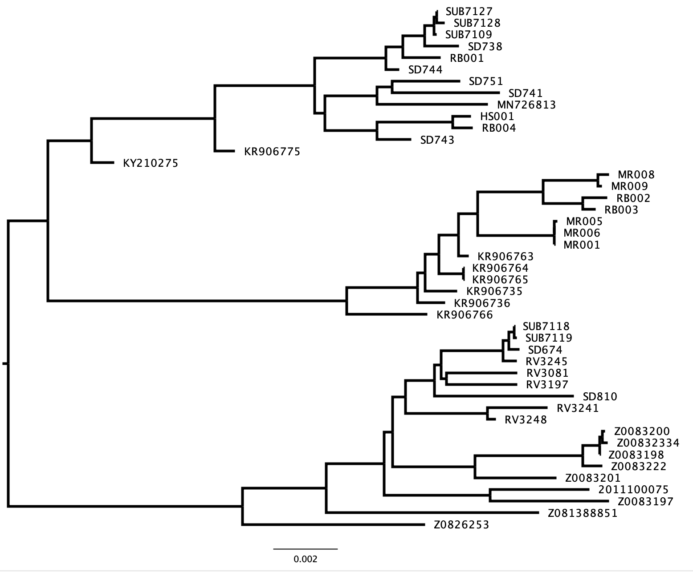

# Tree Interpretation

# Contents

* [4.2.1a: Tree Interpretation]
	+ [4.2.1a.1: A Simple Tree]
	+ [4.2.1a.2: A More Complex Tree]
	+ [4.2.1a.3: Types of Tree]
	
# 4.2.1a: Tree Interpretation

In this practical we will be testing what we learnt in the lecture to interpret trees. We will be checking we know all the parts of the tree, and that we understand the basic information displayed in a tree. 

For this first practical, we won't be working on the VM. Instead, we'll be using our own laptops and just need a word document (or other document type that allows pasting of images and adding arrows and text boxes.)

For reference, here are a few of the diagrams from the slides that might help you here!

|**Parts of a Tree**|
|:--------:|
 

**Monophylogeny**
|:--------:|
 

**Rooting Trees**
|:--------:|
 

**Types of Tree**
|:--------:|
 

## 4.2.1a.1 A Simple Tree

We'll start off with a simple tree.

Copy the image of the tree below into a word (or other appropriate) document. Using shapes and text boxes, annotate all of the following answers onto the tree in the word document. 
|:--------:|
 

___
### Task 1
Using an arrow and text box, label the following parts of the tree:
  1. Tip
  2. Branch 
  3. Node
  
___

### Task 2
Give examples of species in this tree that form:
  1. A monophyletic group
  2. A non-monophyletic group
  3. Which of the above could be described as a 'clade'?

___
  
### Task 3
From this tree, which is the most closely related species to Humans? Which is most distantly related?

___

## 4.2.1a.2 A More Complex Tree

Now we've practiced on a simple tree, can we apply the same knowledge to a more complicated tree?

Copy the image of the tree below into a word (or other appropriate) document. Using shapes and text boxes, annotate all of the following answers onto the tree in the word document. 
|:--------:|
 

___
### Task 3
Using an arrow and text box, label the following parts of the tree:
  1. Tip
  2. Branch 
  3. Node
  4. Root

___
  
### Task 4
There are 3 major clades within this tree. Can you identify the nodes that define these clades?

___
  
### Task 5
From this tree, which sequences are most closely related to SD743? 

___

### Task 6
Which node represents the most recent common ancestor of sequences MR001 and KR906766?

___

### Task 7
What do the branch lengths represent in this tree?

___

## 4.2.1a.3 Types of Tree

___

### Task 8
Looking at the simple and complex trees you have in your document, which of these appears to be outgroup rooted and which appears to be midpoint rooted? 

___

### Task 9
Looking at the simple and complex trees you have in your document, which of these appears to be an additive tree and which appears to be an ultrametric tree? How can you tell?

___

