## Basic *ggplot2* graphs

In this section, you will work on basic plots using *ggplot2* with data
sets on the cities and the climate in the Philippines. Once you become
more familiar with the syntax and the parameters in *ggplot2*, you would
be ready to make more complex figures.

``` r
require(ggpubr)
```

### 1. Data import

If your working directory is the same as the folder containing the
**ph_city.csv**, you can read the file as described in the lecture. Use
`getwd()` to check your working directory and `setwd()` to set a working
directory (likely, **setwd(“\~/R_visualization”)**).

``` r
ph_city = read.csv( file = "ph_city.csv", header = TRUE )

ph_city
```

    ##              City                  Region Population  Latitude Longitude
    ## 1     Quezon_City National_Capital_Region    2960048 14.658559  121.0418
    ## 2          Manila National_Capital_Region    1846513 14.599299  120.9745
    ## 3      Davao_City            Davao_Region    1776949  7.178346  125.4236
    ## 4        Caloocan National_Capital_Region    1661584 14.753709  121.0508
    ## 5  Zamboanga_City     Zamboanga_Peninsula     977234  6.922915  122.0695
    ## 6       Cebu_City         Central_Visayas     964169 10.301413  123.8961
    ## 7        Antipolo              Calabarzon     887399 14.584929  121.1784
    ## 8          Taguig National_Capital_Region     886722 14.550757  121.0508
    ## 9           Pasig National_Capital_Region     803159 14.586235  121.0633
    ## 10 Cagayan_de_Oro       Northern_Mindanao     728402  8.474838  124.6526

You can also import the data manually as the the sheet is not particular
large. However, in most cases, we use functions to bring data into the R
environment.

``` r
# data source - https://en.wikipedia.org/wiki/Philippines

City <- c( "Quezon_City", "Manila", "Davao_City", "Caloocan", "Zamboanga_City", 
           "Cebu_City", "Antipolo","Taguig", "Pasig", "Cagayan_de_Oro" )

Region <- c( "National_Capital_Region", "National_Capital_Region", "Davao_Region",
             "National_Capital_Region", "Zamboanga_Peninsula", "Central_Visayas", 
             "Calabarzon", "National_Capital_Region", "National_Capital_Region",
             "Northern_Mindanao" )

Population <- c( 2960048, 1846513, 1776949, 1661584, 977234, 
                 964169, 887399, 886722, 803159, 728402 )

Latitude <- c( 14.658559, 14.599299, 7.178346, 14.753709, 6.922915, 
               10.301413, 14.584929, 14.550757, 14.586235, 8.474838 )

Longitude <- c( 121.041846, 120.974495, 125.423562, 121.050759, 122.06952, 
                123.896074, 121.178407, 121.050811, 121.063318, 124.652627 )

ph_city <- data.frame( City, Region, Population, Latitude, Longitude )
```

### 2. Barplot

Let’s start with barplot to illustrate the numbers of population in
these cities.

``` r
ggplot() +
  geom_bar( data = ph_city, aes( x = City, y = Population ), stat="identity" )
```

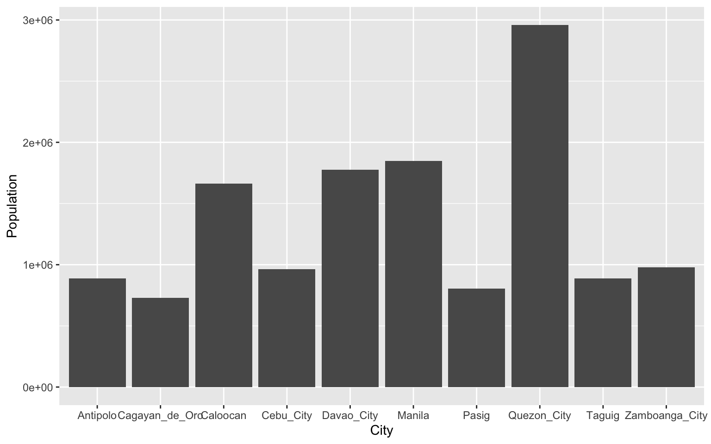

We can see the names of those cities mingling together. There are
several ways to fix the issue; for example, set the axis text to smaller
size. What we will do is to flip the axis by simply setting `x` as
Population and `y` as City.

``` r
ggplot() +
  geom_bar( data = ph_city, aes( x = Population, y = City ), stat="identity" )
```

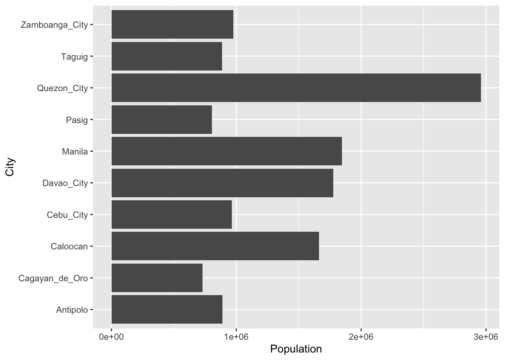

The original csv file ordered the cities based on their population size.
*ggplot2* automatically plots them following an alphabetical order. To
recover the order (and to present a descending/increasing) pattern, we
change the **City** column from *character* to *factor*.

``` r
class(ph_city$City)
```

    ## [1] "character"

``` r
ph_city$City <- factor( x = ph_city$City, levels = ph_city$City )

class(ph_city$City)
```

    ## [1] "factor"

``` r
ggplot() +
  geom_bar( data = ph_city, aes( x = Population, y = City ), stat="identity" )
```

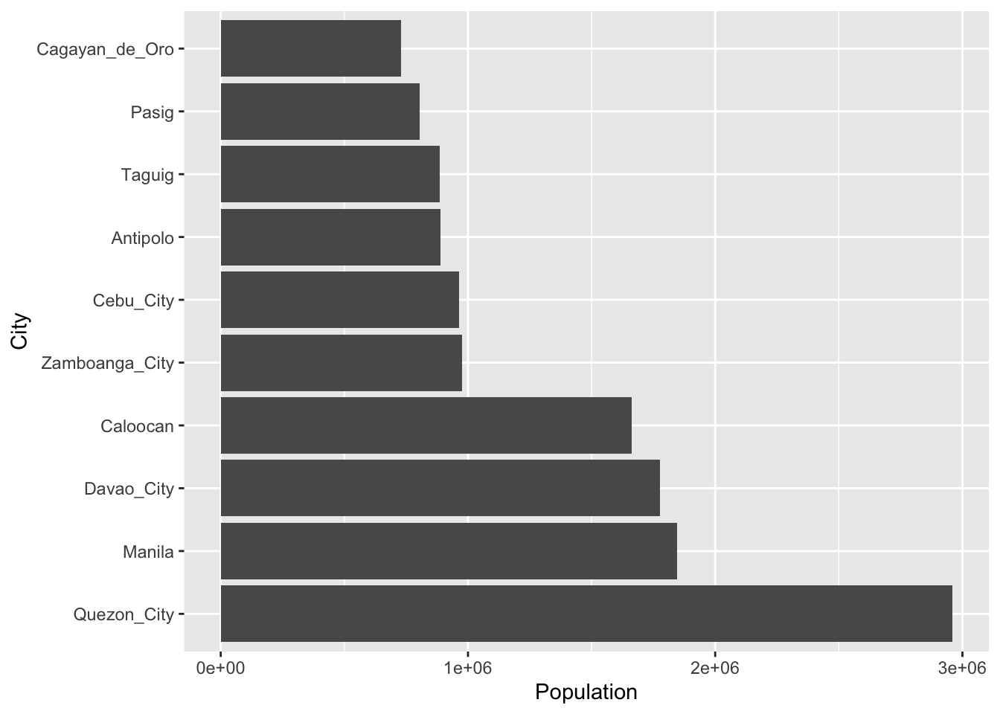

#### 2.1 Color

To highlight the top 3 populated cities among the 10 cities, we can
color the bars with red and blue by specifying the `fill` argument. We
first prepare a vector indicating the colors for these 10 cities. The
`rep` replicates elements- 3 red and 7 blue here.

``` r
col_cities = c( rep( x = "red", 3 ), rep( x = "blue", 7 ) )
col_cities
```

    ##  [1] "red"  "red"  "red"  "blue" "blue" "blue" "blue" "blue" "blue" "blue"

``` r
ggplot() +
  geom_bar( data = ph_city, aes( x = Population, y = City, fill = City ), stat="identity" ) +
  scale_fill_manual( values = col_cities )
```

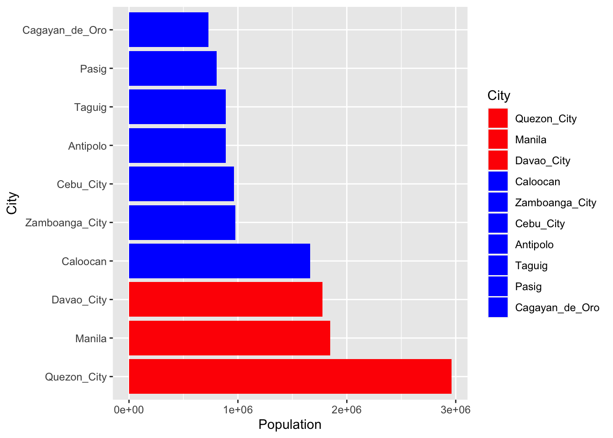

How if we pull `fill=...` out of the `aes(...)` and take it as a general
argument in the `geom_bar`? Note, an error will come up if you use
`fill = City` outside of `aes()`, so you would need to specify a color
for the argument.

``` r
# Note the position of 'fill' here compared to the previous plot

ggplot() +
  geom_bar( data = ph_city, aes( x = Population, y = City), stat="identity", fill = "blue" ) +
  scale_fill_manual( values = col_cities )
```

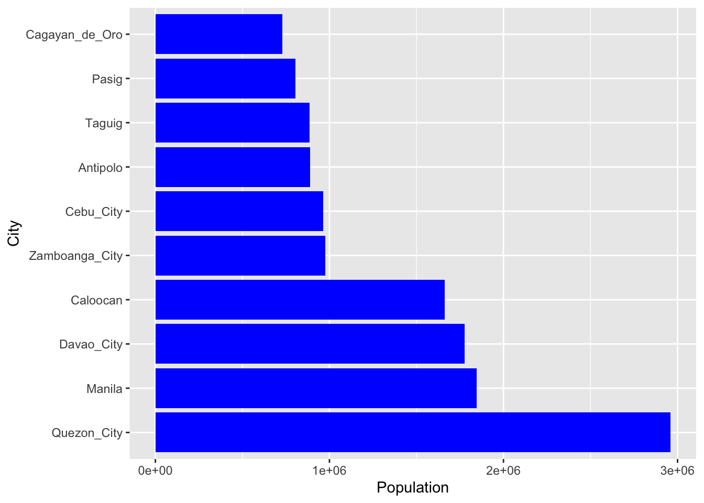

For barplot, the `color` argument will change the edge of the bar while
the most area of the bar is determined by `fill`.

### 3. Dots and scatter plot

#### 3.1 Dotplot

Next we are interested in if particular regions have generally greater
population sizes bases on our available data. To do this, we classify
the population sizes of cities based on which regions they belong to,
and the sizes will be presented as dots.

``` r
ggplot() +
  geom_dotplot( data = ph_city, aes( x = Region, y = Population ), binaxis = "y" ) 
```

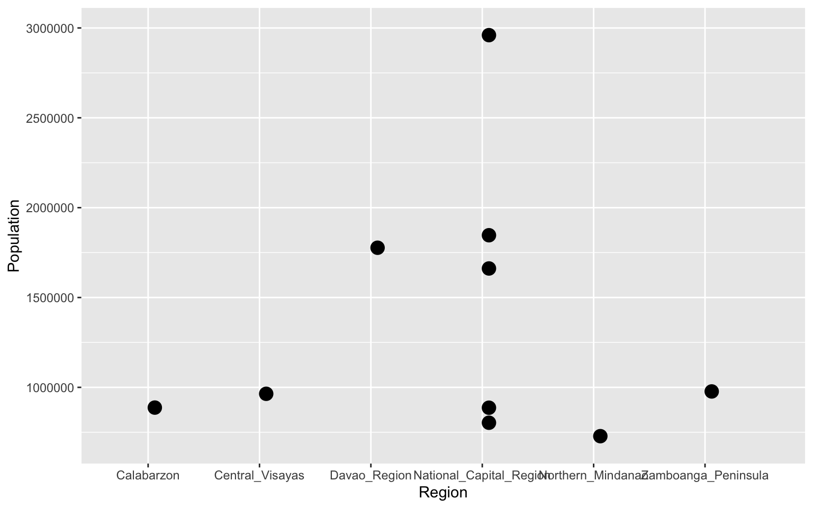

We can then compare the regions by calculating the mean population sizes
in each region using `stat_summary`, although in most regions only one
city in this top-10 list. `fun` (function) determines the type of
summary statistics, and `geom` serves as the similar function as
`geom_point`. The `shape` argument controls the style of points
generated to highlight the mean values. The numbers corresponding to the
shapes can be found here:
<https://ggplot2.tidyverse.org/articles/ggplot2-specs.html>. In this
example, the `2` indicates a hollow triangle with red color specified by
`color`.

``` r
# Using 'stat_summary' to generate summary statistics

ggplot() +
  geom_dotplot( data = ph_city, aes( x = Region, y = Population ), binaxis = "y" ) +
  stat_summary( data = ph_city, aes( x = Region, y = Population ), fun = mean, 
                color="red", geom = "point", shape = 2)
```

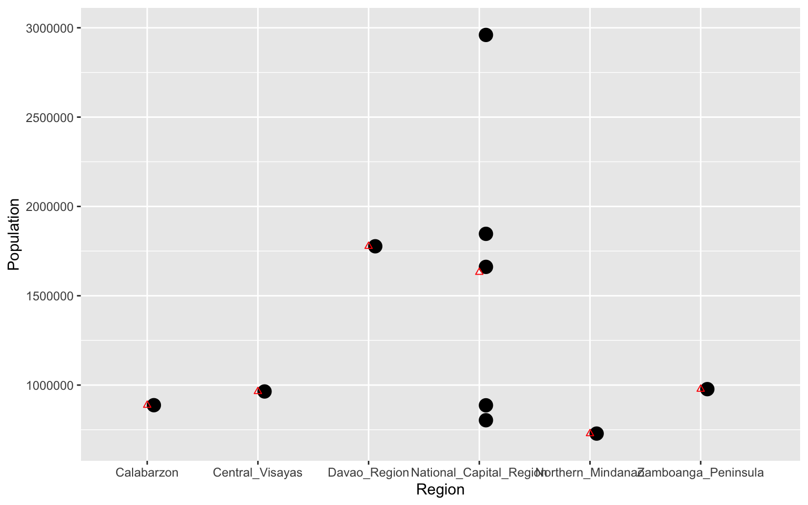

#### 3.2 Scatter plot

To more precisely control the position of each data point, scatter plot
(`geom_point`) may be preferred compared to dotplot (`geom_dotplot`) in
many cases. Let’s label the relative geographical positions of these 10
cities using *ggplot*. To reflect the distribution of the country, we
expand the plot by setting the x and y scale where longitude ranging
between 116-127, and latitude ranging betwen 5-19.

``` r
ggplot() +
  geom_point( data = ph_city, aes( x = Longitude, y = Latitude ) ) +
  scale_x_continuous(limits = c(116,127)) +
  scale_y_continuous(limits = c(5,19))
```

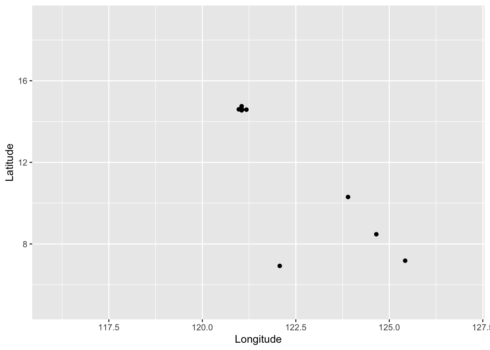

We can add their names next to the points by adding a `geom_text` layer.

``` r
# Labeling the points by 'geom_text'

ggplot() +
  geom_point( data = ph_city, aes( x = Longitude, y = Latitude ) ) +
  scale_y_continuous(limits = c(5,19))  +
  scale_x_continuous(limits = c(116,127))  +
  geom_text( data = ph_city, aes( x = Longitude, y = Latitude, label = City ),
             nudge_x = -1.5 )
```

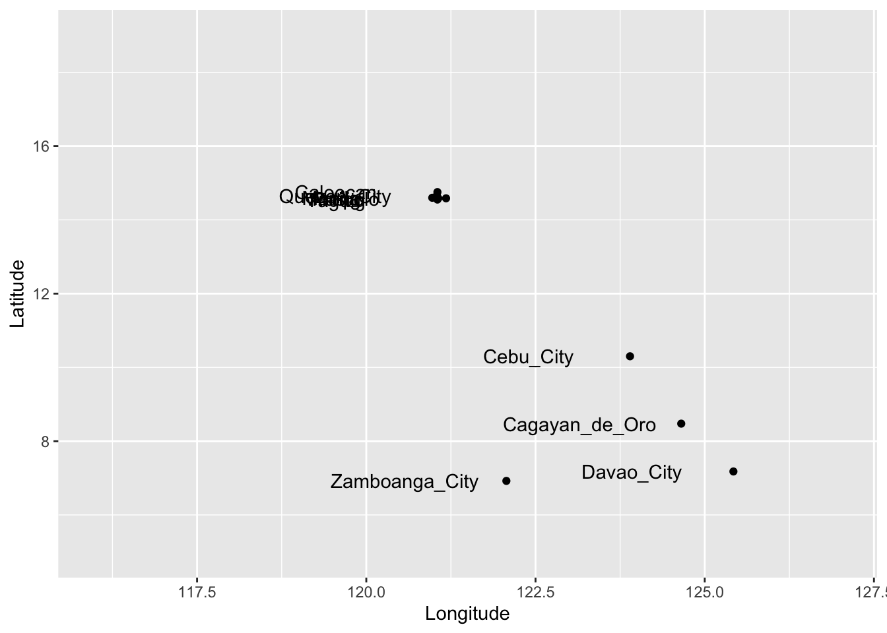

#### 3.3 Size and opacity

To illustrate the numbers of population in each city on the figure, we
adjust the points according to their relative population sizes. The
circles that indicate the cities in National Capital Region are
overlapped. To make them more distinguishable, we lower the opacity of
all the circles by using `alpha`. In addition, we remove the background
by adopting one of the default themes provided by *ggplot2*. Full list
of themes is available here:
<https://ggplot2.tidyverse.org/reference/ggtheme.html>.

``` r
# ggplot2 theme `theme_minimal`

ggplot() +
  geom_point( data = ph_city, aes( x = Longitude, y = Latitude, size = Population ), alpha = 0.3 ) +
  scale_x_continuous(limits = c(116,127)) +
  scale_y_continuous(limits = c(5,19))  +
  geom_text( data = ph_city, aes( x = Longitude, y = Latitude, label = City ),
             nudge_x = -1.5 ) +
  theme_minimal()
```

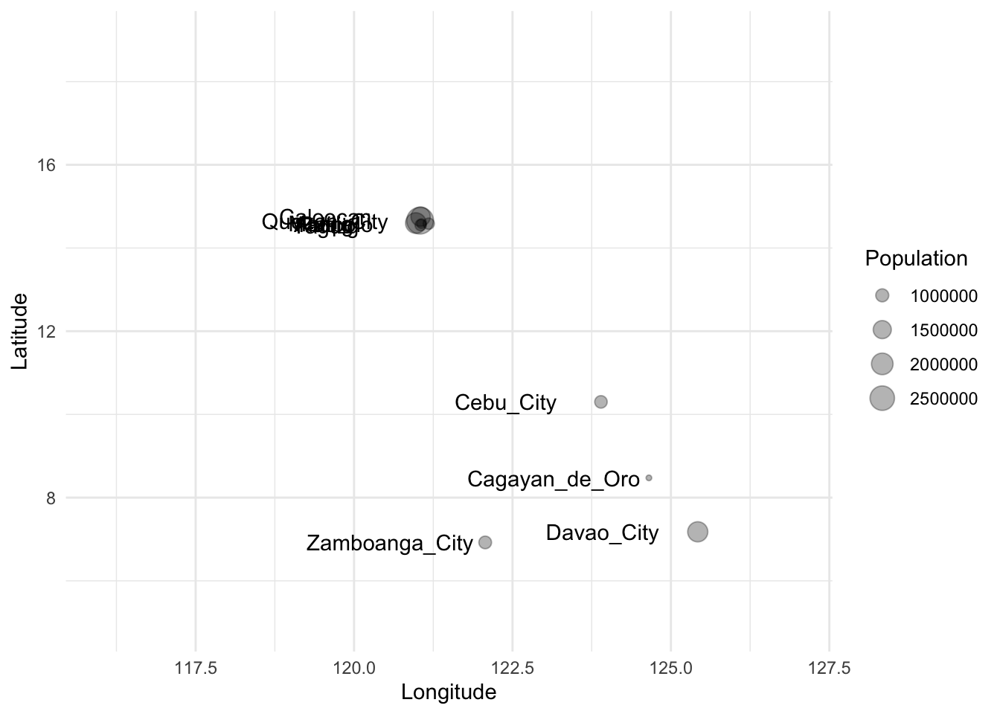

#### 3.4 Combing multiple figures

To differentiate the relative locations of the cities in the NCR region,
we can generate another figure with a closer view window and then
combine the two figures as separate panels into one figure. The zoom-in
panel will be generated with different coordinates at both axes.

``` r
# Cropping the larger figure by setting the 'limits' in x and y scales 

ggplot() +
  geom_point( data = ph_city, aes( x = Longitude, y = Latitude, size = Population ), alpha = 0.3 ) +
  scale_x_continuous(limits = c(120.97,121.25)) +
  scale_y_continuous(limits = c(14.5,14.8))  +
  geom_text( data = ph_city, aes( x = Longitude, y = Latitude, label = City ),
             nudge_x = 0.03 ) +
  theme_minimal()
```

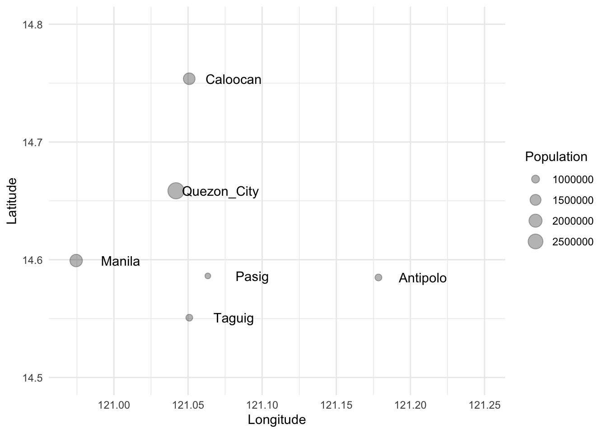

We then assign the two figures as ggplot objects with different names
(variable names). Thanks to the package `ggpubr`, the function
`ggarrange` combines multiple figures as one easily. Arguments in
`ggarrange`, for example, `labels`, `align`, are useful in scientific
papers.

``` r
f_large <- 
ggplot() +
  geom_point( data = ph_city, aes( x = Longitude, y = Latitude, size = Population ), alpha = 0.3 ) +
  scale_x_continuous(limits = c(116,127)) +
  scale_y_continuous(limits = c(5,19))  +
  geom_text( data = ph_city, aes( x = Longitude, y = Latitude, label = City ),
             nudge_x = -1.5 ) +
  theme_minimal()

f_small <- 
ggplot() +
  geom_point( data = ph_city, aes( x = Longitude, y = Latitude, size = Population ), alpha = 0.3 ) +
  scale_x_continuous(limits = c(120.97,121.25)) +
  scale_y_continuous(limits = c(14.5,14.8))  +
  geom_text( data = ph_city, aes( x = Longitude, y = Latitude, label = City ),
             nudge_x = 0.03 ) +
  theme_minimal()


ggarrange( f_large, f_small, 
           ncol = 2, nrow = 1, 
           common.legend = TRUE, legend = "bottom",
           labels = c("(A) All", "(B) NCR") )
```

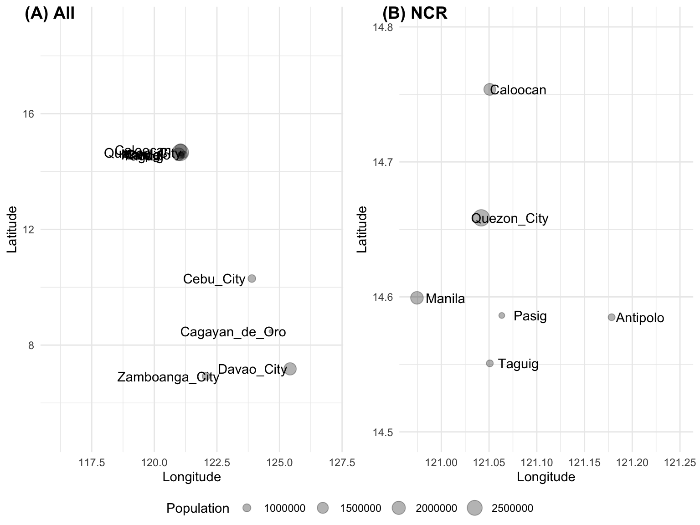

### 4. Lines

Finally, we will work on some lines! Before making the plot, we first
enter another data set, which contains the the mean temperature and
precipitation over the year in the Philippines.

``` r
Tem <- c( 24.72, 24.88, 25.71, 26.68, 27.02, 26.47, 
          25.94, 25.92, 25.9, 25.83, 25.65, 25.21 )

Rain <- c( 136.93, 96.05, 92.56, 97.66, 188.95,
           248.37, 291.02,  310.68, 281.05, 280.74, 230.51, 206.84 )

# `seq` for sequence generation
Month <- seq(1,12)

ph_climate <- data.frame( Month, Tem, Rain )

ph_climate
```

    ##    Month   Tem   Rain
    ## 1      1 24.72 136.93
    ## 2      2 24.88  96.05
    ## 3      3 25.71  92.56
    ## 4      4 26.68  97.66
    ## 5      5 27.02 188.95
    ## 6      6 26.47 248.37
    ## 7      7 25.94 291.02
    ## 8      8 25.92 310.68
    ## 9      9 25.90 281.05
    ## 10    10 25.83 280.74
    ## 11    11 25.65 230.51
    ## 12    12 25.21 206.84

Hope you’ve already guessed the function we will be using for the line
plot - `geom_line`. To have both temperature and rainfall in the same
figure, we can use two `geom_line` components.

``` r
ggplot() +
  geom_line( data = ph_climate, aes( x = Month, y = Tem ), color = "red" ) +
  geom_line( data = ph_climate, aes( x = Month, y = Rain ), color = "blue" )
```

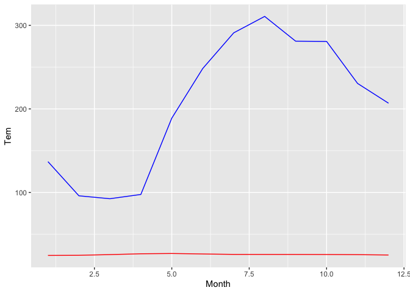<!-- -->

However, the current dataframe is not the optimal data structure because
in each row there’s no indicator to differentiate the property of the
variables. To reshape the current “wide” dataframe to a “long” one,
which is preferred by *ggplot2*, we manually create another dataframe
called ph_climate2. There are functions helping you transform data but
we will not cover them in this course.

``` r
climate_data <- c(Tem, Rain)

Data_type <- c( rep("Tem", 12), rep("Rain", 12) )

Month <- c( Month, Month )

ph_climate2 <- data.frame( climate_data, Data_type )

ph_climate2
```

    ##    climate_data Data_type
    ## 1         24.72       Tem
    ## 2         24.88       Tem
    ## 3         25.71       Tem
    ## 4         26.68       Tem
    ## 5         27.02       Tem
    ## 6         26.47       Tem
    ## 7         25.94       Tem
    ## 8         25.92       Tem
    ## 9         25.90       Tem
    ## 10        25.83       Tem
    ## 11        25.65       Tem
    ## 12        25.21       Tem
    ## 13       136.93      Rain
    ## 14        96.05      Rain
    ## 15        92.56      Rain
    ## 16        97.66      Rain
    ## 17       188.95      Rain
    ## 18       248.37      Rain
    ## 19       291.02      Rain
    ## 20       310.68      Rain
    ## 21       281.05      Rain
    ## 22       280.74      Rain
    ## 23       230.51      Rain
    ## 24       206.84      Rain

``` r
# Using color to differentiate two types of data

ggplot() +
  geom_line( data = ph_climate2, aes( x = Month, y = climate_data, color = Data_type ) )
```

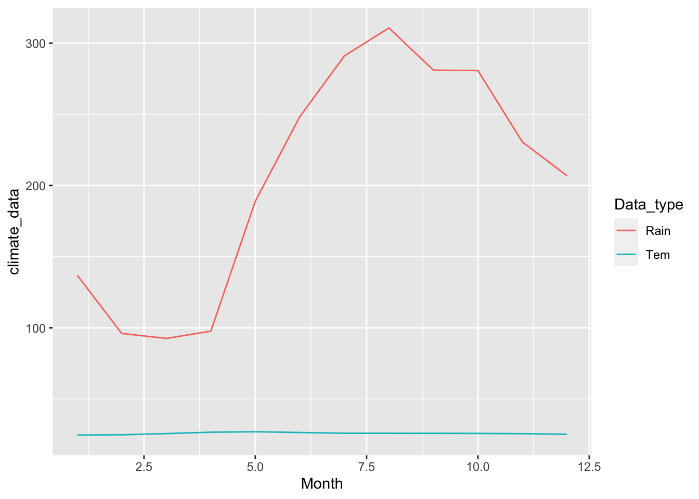

It’s straightforward to add points on the lines by `geom_point`.

``` r
# Adding points on the line by another geometry layer

ggplot() +
  geom_line( data = ph_climate2, aes( x = Month, y = climate_data, color = Data_type ) ) +
  geom_point( data = ph_climate2, aes( x = Month, y = climate_data, color = Data_type ) )
```

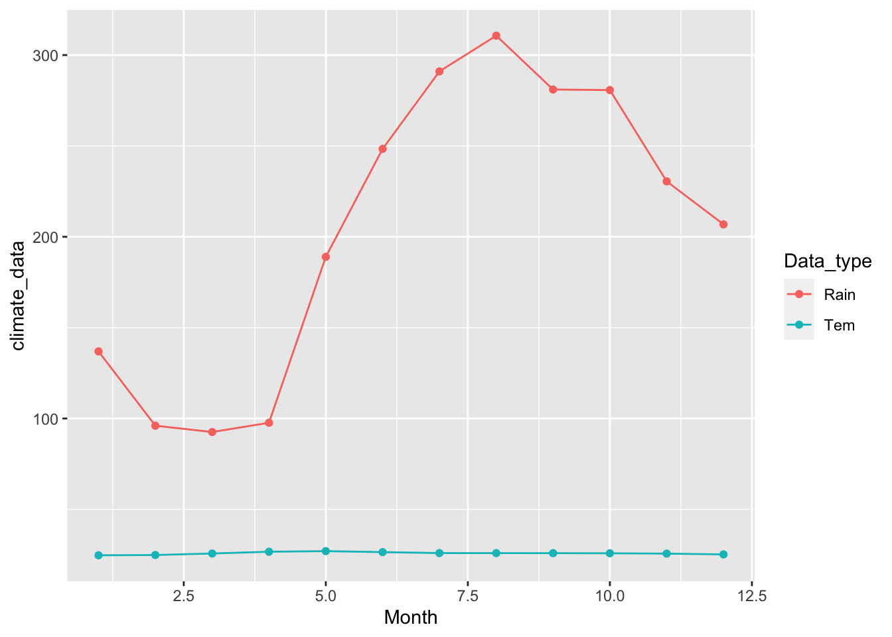

#### 4.1 Axis labeling and titles

The current figure can be further improved at several aspects. We will
focus on the text and the titles on the axis, in addition to the legend.
We would like to have the x-axis showing months as characters. Also, the
y-axis title should be “Temperature/Rainfall”. Labels in the legend
should also be modified. These can be achieved using the following
functions:

-   `scale_x_continuous()`
-   `scale_color_discrete()`
-   `ylab()`
-   `legend.title` and `legend.position` in `theme()`

``` r
x_axis_lab_c = c( "Jan", "Feb", "Mar", "April", "May", "June", 
                  "July", "Aug", "Sep", "Oct", "Nov", "Dec" )


ggplot() +
  geom_line( data = ph_climate2, aes( x = Month, y = climate_data, color = Data_type ) ) +
  geom_point( data = ph_climate2, aes( x = Month, y = climate_data, color = Data_type ) ) +
  scale_x_continuous( breaks = seq(1,12), labels = x_axis_lab_c ) +
  theme_bw() +
  ylab( "Rainfall(mm) / Temperature(C)" ) +
  scale_color_discrete( labels = c("Rainfall", "Temperature") ) +
  theme( legend.title = element_blank(),
         legend.position = c(0.2,0.75) )
```

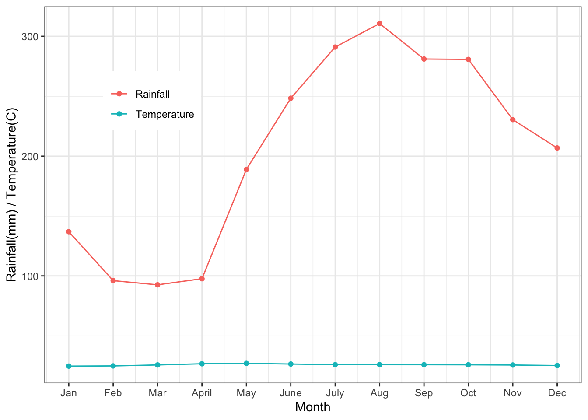

You will learn how to make a double y-axis figure soon in the next
section. Until now, you have learned how to use different geometry
functions including **geom_bar**, **geom_point** and **geom_line**.
You’ve used different arguments including **color**, **shape**,
**alpha**, to modify the style of the graphs. You should know how these
arguments will function if they are located in the aesthetic mapping
section (**aes()**). Finally, adjusting the scale and the themes confer
a huge flexibility to visualization for different purposes. These
experiences will allow you to move on to practical examples in the next
section.
